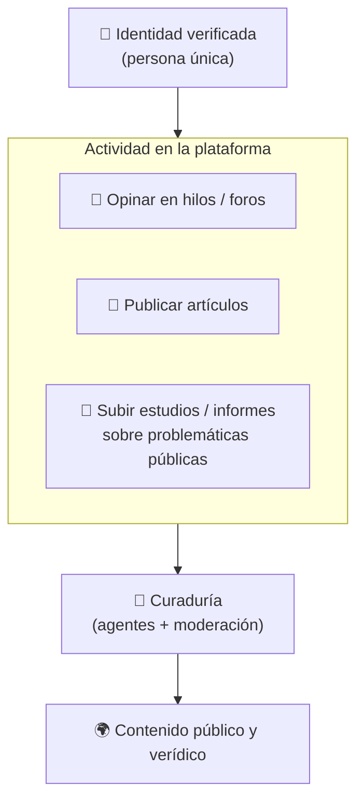

# Plataforma de Opinión Verificada

La **aplicación** que construimos sobre el núcleo de identidad. Desarrolla la Capa 2 de
[[IDEA]].

## Qué es

Una **plataforma on-chain** donde personas verificadas pueden **expresar su opinión sin
sesgos ni riesgo** en cualquier hilo o foro de discusión, y **publicar conocimiento**
(artículos, estudios, informes) de forma verídica y atribuible a su identidad.

La diferencia con cualquier foro tradicional: **cada participante es una
[[Prueba de Persona Única|persona real y única]]**. No hay bots, no hay granjas de
cuentas, no hay sockpuppets. Eso cambia por completo la calidad y la confianza del
debate.

## Qué se puede hacer

- **Opiniones** en hilos o foros de discusión que arme cualquier persona.
- **Artículos** propios.
- **Estudios e informes** sobre problemáticas públicas que la persona haya realizado.
- En general: *todo lo que quiera que sea conocido y verídico bajo su identidad*.

## El objetivo: impacto social

Crear una **plaza pública digital** donde:

- La opinión se da **sin miedo a ser juzgado** (la identidad real puede quedar protegida →
  [[Identidad Pública vs Anónima]]).
- El conocimiento publicado es **verídico** (respaldado por curaduría → [[Curaduría y Agentes Validadores]]).
- La participación es de **humanos reales y únicos** (respaldado por
  [[Prueba de Persona Única]]).

El resultado buscado: un espacio de debate y difusión de conocimiento de **alta calidad y
alta confianza**, imposible de inundar con bots o cuentas falsas.

## Por qué la identidad verificada lo cambia todo

| Problema de los foros tradicionales | Cómo lo resuelve la plataforma |
|---|---|
| Bots y cuentas falsas inflan opiniones | 1 persona real = 1 identidad ([[Prueba de Persona Única]]) |
| Granjas de votos / sockpuppets | Nullifier de unicidad impide multicuenta |
| Desinformación sin filtro | Curaduría con [[Curaduría y Agentes Validadores\|agentes + moderadores]] |
| Exposición / miedo a opinar | Anonimato verificado ([[Identidad Pública vs Anónima]]) |

## Preguntas abiertas

- [ ] ¿La lectura es libre para todos o sólo para verificados? → [[Identidad Pública vs Anónima#Visibilidad y acceso]]
- [ ] ¿Cómo se estructuran los hilos/foros y la autoría on-chain? (modelo de datos de la app)
- [ ] ¿Qué se guarda on-chain y qué off-chain (contenido pesado como PDFs de estudios)?

Relacionado: [[IDEA]] · [[Prueba de Persona Única]] · [[Curaduría y Agentes Validadores]] · [[Identidad Pública vs Anónima]]
