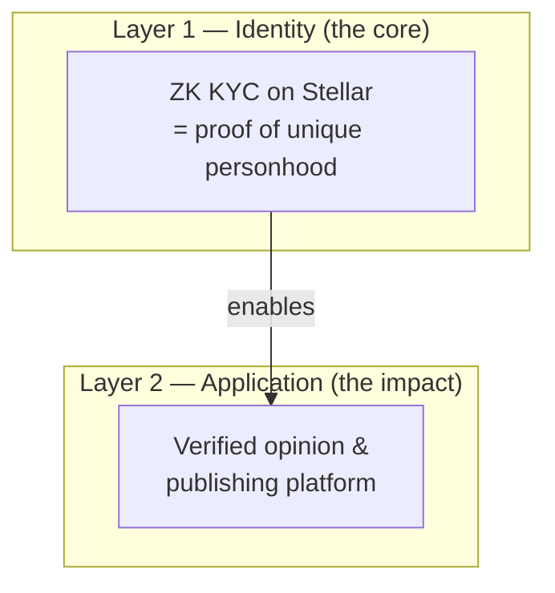

# Introduction

Welcome to the **human** documentation.

**human** lets a person prove they completed identity verification **without revealing personal data on-chain**, using Zero-Knowledge proofs verified inside a Stellar (Soroban) smart contract. On top of that foundation, **human** powers a verified opinion and publishing platform where real humans can participate without exposing who they are.

## The two layers

| Layer | What it does | Status |
|---|---|---|
| **Layer 1** | One real person = one verified identity, anonymously | Implemented on testnet |
| **Layer 2** | Post opinions and articles as a verified but anonymous human | First iteration live |
| **Funding ZK** | Anonymous conditional crowdfunding | Future work → [Funding ZK](whats-next/funding-zk.md) |

## Who this documentation is for

* **Judges & reviewers** — understand the problem, why ZK is essential, and what is demonstrable today.
* **Developers** — architecture, setup, contracts, SDK integration.

Start with [What is human?](introduction/what-is-human.md) or jump to [For judges and developers](introduction/for-judges-and-developers.md).

## Quick links

* [System overview](architecture/overview.md)
* [KYC flow](architecture/kyc-flow.md)
* [Environment setup](developer-guides/environment-setup.md)
* [SDK quickstart](sdk/quickstart.md)
* [Security & limitations](security/limitations.md)
