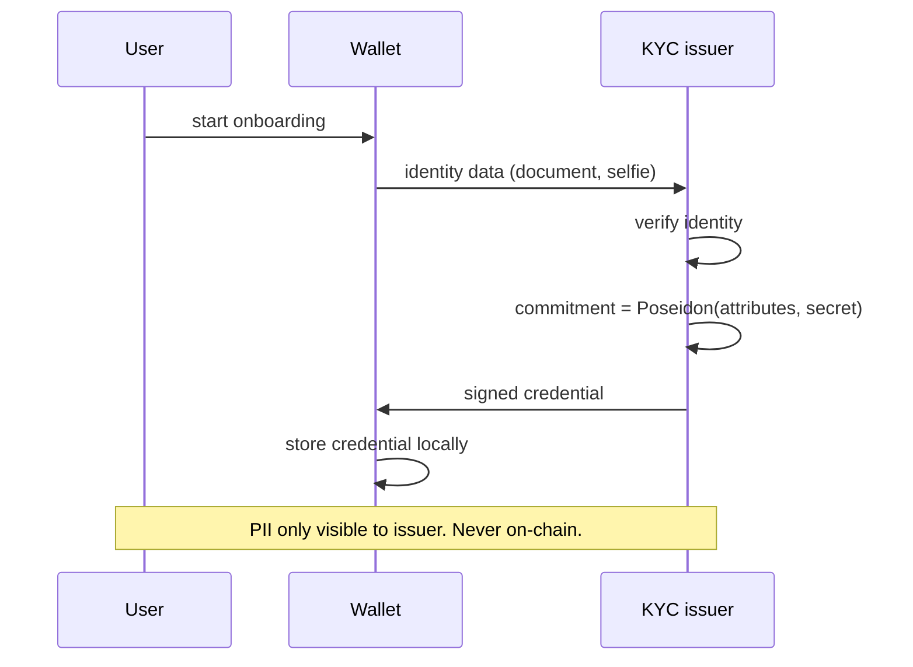
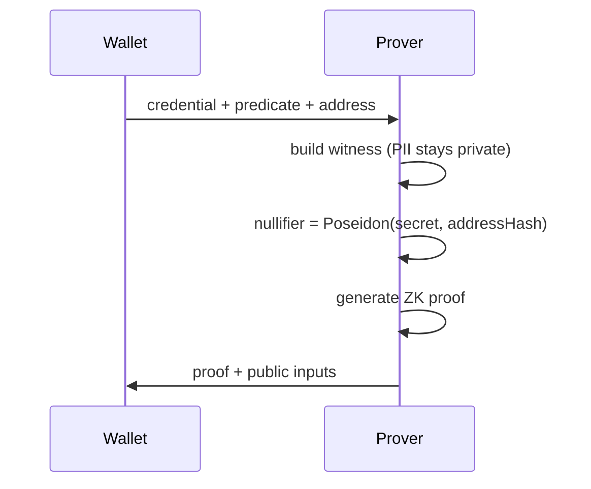
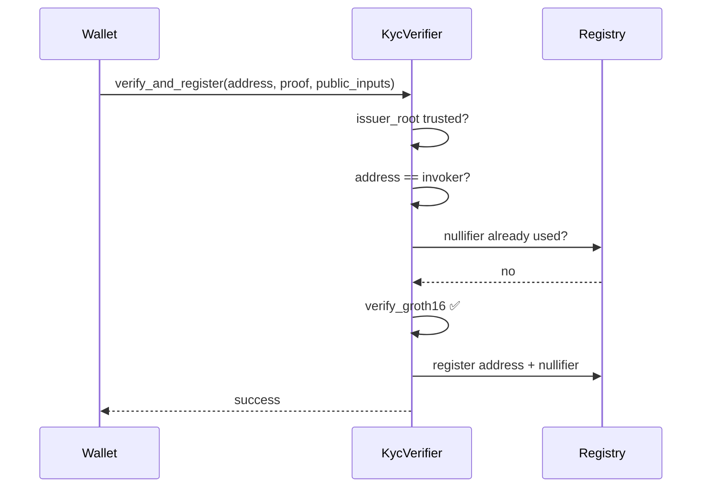
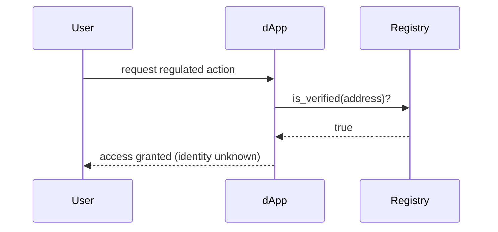

# KYC end-to-end flow

Step-by-step journey from identity verification to dApp access.

## Phase 1 — Credential issuance (once)

**Testnet:** verification = document photo + live face match (matcher gate).

## Phase 2 — Proof generation (each time needed)

Output is a proof — not raw data.

## Phase 3 — On-chain verification and registration

## Phase 4 — dApp consumption

## Security properties

| Property | Mechanism |
|---|---|
| **Address binding** | Proof tied to `addressHash`; invoker must match |
| **Anti-Sybil** | Nullifier stored on-chain; reuse rejected |
| **Trusted issuer** | Only credentials under configured `issuerRoot` accepted |
| **PII containment** | PII only sent to issuer in Phase 1 |

## Implementation references

| Phase | Code |
|---|---|
| 1 | `identity/issuer/matcher/` |
| 2 | `packages/sdk/` (`generateProof`) |
| 3 | `identity/contracts/kyc_verifier/` |
| 4 | `is_verified` query via SDK |
| E2E | `scripts/e2e_demo.sh` |

## Related

* [Layer 1 — Identity](layer-1-identity.md)
* [Running the demo](../developer-guides/running-the-demo.md)
