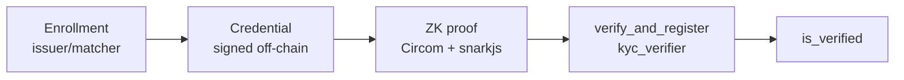

# Layer 1 — Identity (KYC-ZK)

Layer 1 is the **proof-of-unique-personhood** core of **human**.

## Goals

* One real person registers **once**.
* Registration is **anonymous on-chain** (no PII).
* Any Stellar dApp can check `is_verified(address)`.

## Pipeline

## Enrollment gate (testnet)

Before any ZK logic runs, the user must pass the **identity matcher**:

1. Upload ID document photo.
2. Live face scan (liveness).
3. Matcher confirms face matches document + anti-duplicate checks.
4. Issuer creates signed credential with Merkle leaf.

Production path: replace matcher with licensed KYC (e.g. national ID authority integration).

## Circuit (`kyc.circom`)

Proves (among other checks):

* Credential signed by trusted issuer.
* Commitment included in issuer Merkle tree (`issuerRoot`).
* Predicate satisfied (e.g. age ≥ 18).
* `nullifier = Poseidon(secret, addressHash)` — address-bound, anti-Sybil.
* `addressHash` matches transaction invoker.

Curve: **BLS12-381** (Groth16).

## Contract (`kyc_verifier`)

| Function | Purpose |
|---|---|
| `init(trusted_root, vk)` | Bootstrap issuer root + verifying key |
| `verify_and_register(proof, public_inputs)` | Verify + register address + store nullifier |
| `is_verified(address)` | Query for dApps |

## SDK functions (Layer 1)

| Function | Role |
|---|---|
| `generateProof(...)` | Build witness + Groth16 proof client-side |
| `verifyAndRegister(...)` | Submit Soroban transaction |
| `isVerified(address)` | Read registry |

## Anti-fraud measures

* **Document data cross-check** — OCR extracts document number and birth year; must match user-declared data.
* **Early exit** — if `is_verified(address)` already true, enrollment blocked in UI.
* **Nullifier on-chain** — second registration rejected even if UI bypassed.
* **Document de-duplication** — same document cannot enroll twice.

## Related

* [KYC flow](kyc-flow.md)
* [Proof of unique personhood](../concepts/proof-of-unique-personhood.md)
* [Security & limitations](../security/limitations.md)
