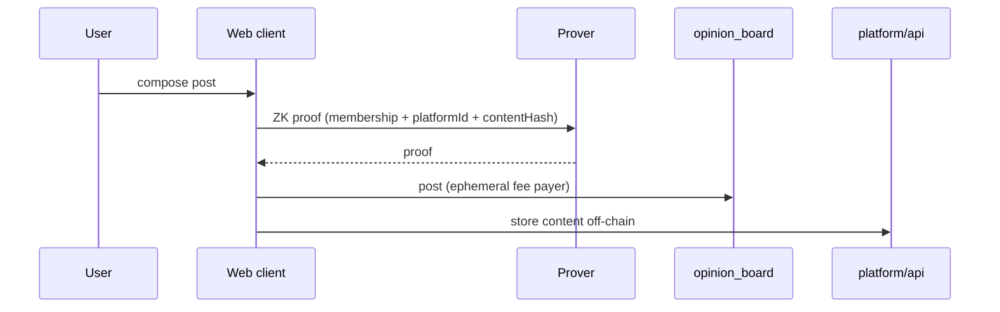

# Layer 2 — Anonymous platform

Layer 2 is the **verified opinion and publishing platform** — anonymous participation powered by Layer 1.

## Problem solved

Posting with your KYC wallet address lets anyone link opinions to your on-chain identity. Layer 2 uses **`platformId`** instead — derived from your Layer 1 secret, unlinkable to your Stellar address.

## Components

| Piece | Location | Role |
|---|---|---|
| Platform circuit | `platform/circuits/` | Prove Merkle membership + bind `platformId` + `contentHash` |
| `opinion_board` | `platform/contracts/` | On-chain anchor: `register_identity`, `post` |
| `platform/api` | Off-chain | Profile, username, feed, article bodies |
| `platform/curation` | Off-chain | AI agent + human moderation |
| Web UI | `web/src/platform/` | Anonymous identity, posting, feed |

## Posting flow

## Ephemeral fee payer

Even if posts don't use the KYC address, **someone pays the transaction fee**. Using the KYC wallet would deanonymize activity.

**Solution:** generate a throwaway account funded on testnet (friendbot). Production: fee relayer or meta-transactions.

## Curation

* AI scores posts against a rubric.
* Escalated items go to human moderators.
* Moderators see `platformId` + content only — no PII, no Stellar address.

## Storage model

| Data | Where |
|---|---|
| `platformId`, `contentHash` | On-chain (`opinion_board`) |
| Post text, articles, avatars | Off-chain (`platform/api`) |
| Moderation verdicts | Off-chain (`platform/curation`) |

## Bridge to Layer 1

Layer 2 does **not** call `is_verified(address)`. It proves **Merkle membership in `issuerRoot`** — the same set of verified humans, without revealing which leaf.

See [Platform identity (platformId)](platform-identity.md).

## Related

* [Verified opinion platform](../concepts/verified-opinion-platform.md)
* [Architecture overview](overview.md)
