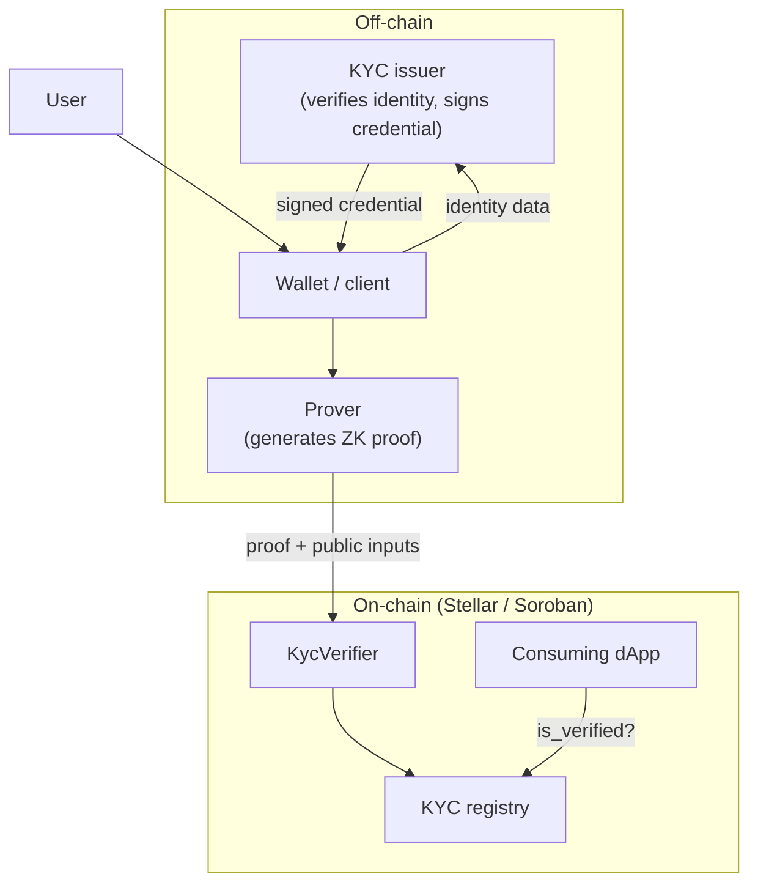
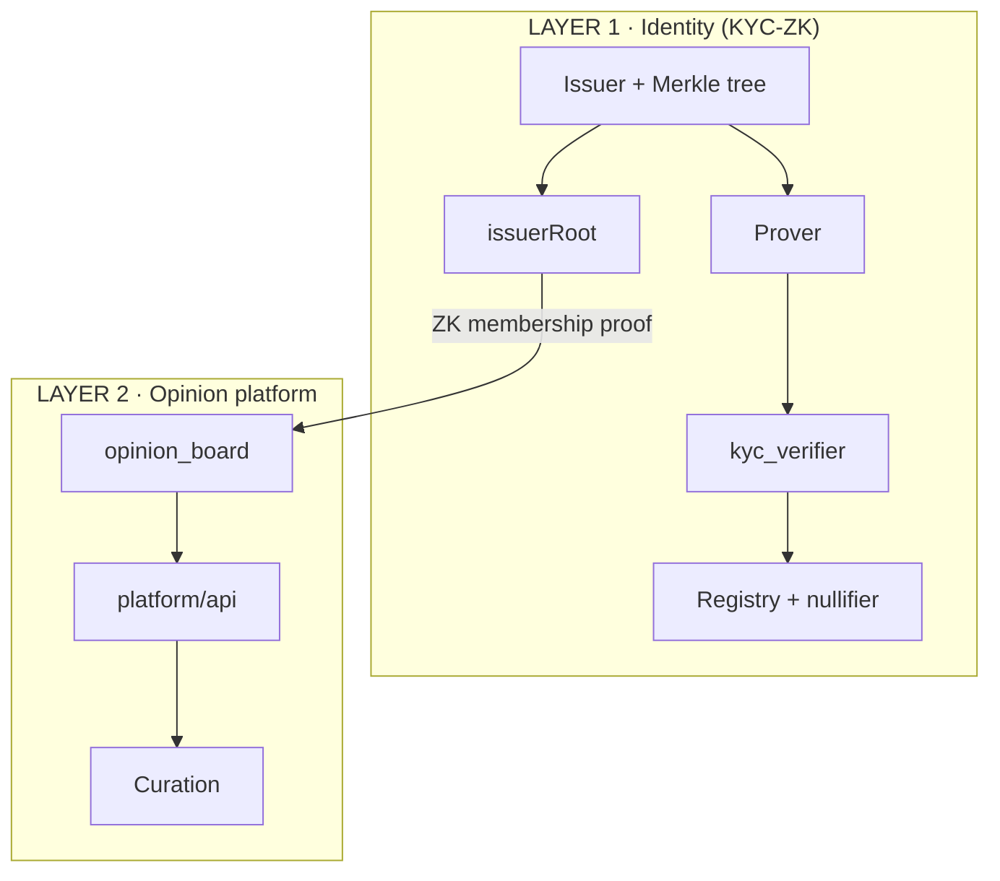

# System overview

Bird's-eye view of **human** components and how they connect.

## Components

## Responsibilities

| Component | Location | Role |
|---|---|---|
| **KYC issuer** | Off-chain | Verify real identity; issue signed credential. Testnet: face matcher (document + selfie). |
| **Wallet / client** | Off-chain | Store credential; orchestrate flow |
| **Prover** | Off-chain | Generate ZK proof from credential + predicate |
| **KycVerifier** | Soroban | Verify proof via host functions; register address |
| **Registry** | On-chain storage | `address → verified` + used nullifiers |
| **Consuming dApp** | Soroban / off-chain | Gate features with `is_verified(address)` |

## Design principle: where each thing runs

* **Prove** = off-chain (expensive, private).
* **Verify** = on-chain (cheap with Stellar ZK primitives).

## human's two product layers

### Two bridges from Layer 1

| Bridge | Use case | Linkability |
|---|---|---|
| `is_verified(address)` | Generic dApps | Pseudonymous (Stellar address) |
| Merkle `issuerRoot` membership | Anonymous platform | Anonymous (`platformId`) |

The opinion platform uses **issuerRoot membership** — never the KYC address.

## Code mapping

| Component | Repo path |
|---|---|
| Issuer + matcher | `identity/issuer/` |
| Layer 1 circuit | `identity/circuits/` |
| `kyc_verifier` | `identity/contracts/kyc_verifier/` |
| Layer 2 circuit | `platform/circuits/` |
| `opinion_board` | `platform/contracts/opinion_board/` |
| Feed / profile API | `platform/api/` |
| Curation | `platform/curation/` |
| SDK | `packages/sdk/` |
| Frontend | `web/src/kyc/` + `web/src/platform/` |

## Related

* [Layer 1 — Identity](layer-1-identity.md)
* [Layer 2 — Platform](layer-2-platform.md)
* [KYC flow](kyc-flow.md)
* [Repository structure](../developer-guides/repository-structure.md)
