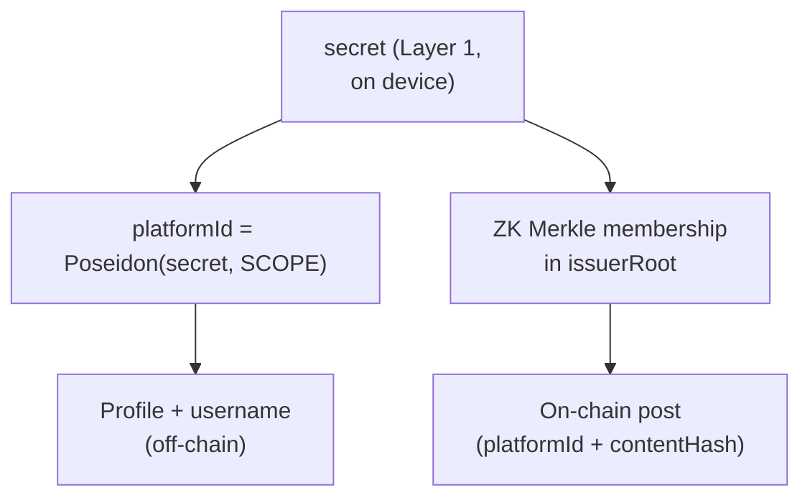

# Platform identity (platformId)

How Layer 2 achieves **anonymous but persistent** identity.

## One-liner

On the platform you are not your KYC wallet — you are your **`platformId`**, a pseudonym derived from your Layer 1 `secret` via a one-way function.

## Construction

## Properties

| Property | How |
|---|---|
| **Anonymous** | `platformId` is one-way from `secret` — no PII, no address |
| **Persistent** | Same `secret` + `SCOPE` → same `platformId` always |
| **Unique per human** | One `secret` per enrolled person → one `platformId` |
| **Verified** | Each action includes ZK proof of `issuerRoot` membership |
| **Content-bound** | `contentHash` inside proof — tampering invalidates it |

## Why not `is_verified(address)`?

Calling `is_verified` on the KYC address forces the platform to act as that address. Anyone could link posts to the `verify_and_register` transaction → **pseudonymous, not anonymous**.

Layer 2 uses **Merkle membership** in the same human set without revealing which member.

## Ephemeral accounts

Transaction fees must be paid. Using the KYC wallet as fee payer deanonymizes you.

* **Testnet:** ephemeral account + friendbot funding.
* **Production:** relayer service or meta-transactions.

## Handle display

Short handle derived from `platformId` (e.g. last 5 hex chars) for readable attribution without exposing the full id.

## Related

* [Layer 2 — Platform](layer-2-platform.md)
* [Architecture overview](overview.md)
