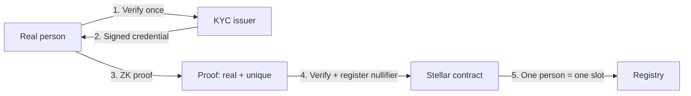

# Proof of unique personhood

The technical core of **human** (Layer 1).

## Definition

A cryptographic proof that the registrant is:

1. **A real person** — passed identity verification (KYC).
2. **Unique** — one person cannot register twice (anti-Sybil).
3. **Anonymous** — none of the above reveals PII on-chain.

This is *proof of personhood* / *proof of unique humanity*. Every opinion or post from a verified human carries weight — it is not a bot or a sock puppet.

## The apparent contradiction

* If identity is **anonymous**, how do you stop the same person registering 100 times?
* If you enforce **uniqueness**, don't you need to know who they are?

**Answer:** Zero-Knowledge proofs + a **deterministic uniqueness nullifier**.

## How it works

1. Person verifies identity **once** with an issuer.
2. Receives a **signed credential** (commitment to attributes; nothing published).
3. Generates a **ZK proof** off-chain.
4. Contract verifies proof and stores a **uniqueness nullifier**.
5. Second registration with the same person → same nullifier → **rejected**.

## The uniqueness nullifier

A nullifier is a unique value derived from the user's secret. For global uniqueness:

* Same human → same nullifier → contract rejects re-registration.
* Nullifier does **not** reveal identity (one-way hash).

> Fine design point: per-person uniqueness depends on the issuer binding the credential to a stable real-world identifier without publishing it.

## What is revealed vs hidden

| Data | On-chain? |
|---|---|
| Name, document, PII | Never |
| That someone is verified | Yes (address flag) |
| Uniqueness nullifier | Yes (hash only) |
| Which credential in the Merkle tree | Hidden (ZK) |

## Implementation

* Circuit: `identity/circuits/src/kyc.circom` (Circom, BLS12-381, Merkle inclusion).
* Contract: `identity/contracts/kyc_verifier/`.
* Flow: [KYC end-to-end flow](../architecture/kyc-flow.md).

## Related

* [Zero-knowledge basics](zero-knowledge-basics.md)
* [Layer 1 architecture](../architecture/layer-1-identity.md)
* [Glossary](../glossary.md)
