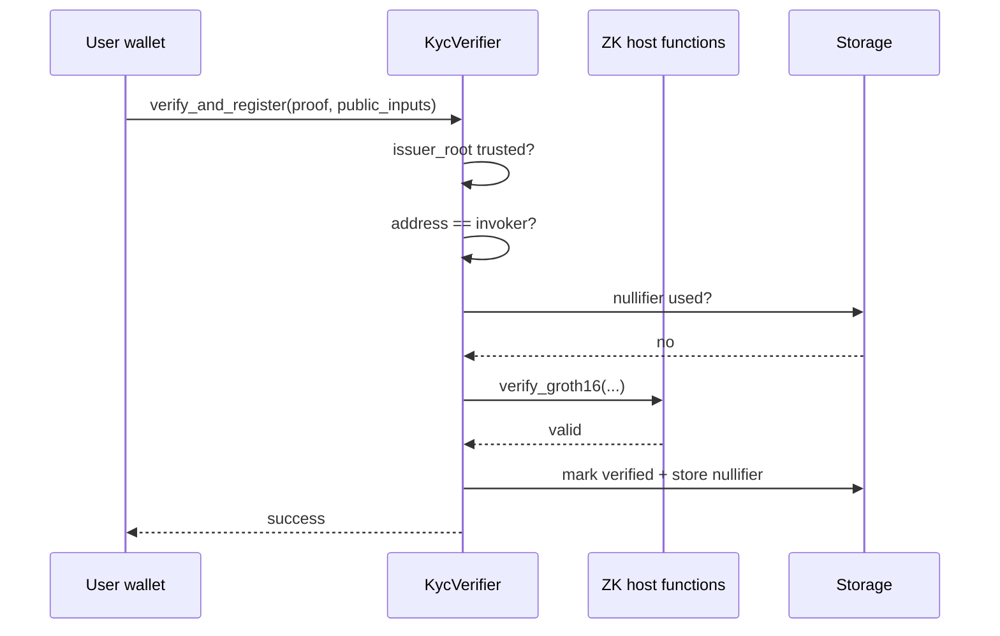

# Stellar and Soroban

Why **human** is built on Stellar and how on-chain verification works.

## Stellar

A blockchain focused on payments, stablecoins, and real-world assets (RWAs). **human** targets Stellar because:

* Growing ZK host functions (Protocols 25–26).
* Soroban smart contracts in Rust → Wasm.
* Active ecosystem for regulated, identity-sensitive use cases.

## Soroban

Stellar's smart contract platform. Contracts are written in Rust, compiled to Wasm, and executed by the Soroban runtime.

**human** contracts:

| Contract | Layer | Purpose |
|---|---|---|
| `kyc_verifier` | 1 | Verify Groth16 proof; register verified addresses |
| `opinion_board` | 2 | Anchor posts (`platformId` + `contentHash`) |

## Host functions (ZK primitives)

Native runtime functions — much cheaper than implementing pairings in Wasm.

| Primitive | Role in human |
|---|---|
| `verify_groth16` | Check SNARK proof against embedded VK |
| Poseidon / Poseidon2 | Hash commitments and nullifiers in-circuit |
| MSM | Multi-scalar multiplication for verification |

Without these, on-chain ZK verification would be prohibitively expensive.

## KycVerifier responsibilities

1. Verify ZK proof against embedded verifying key.
2. Validate public inputs (trusted issuer root, address binding, unused nullifier).
3. Register `address → verified` in persistent storage.
4. Expose `is_verified(address)` for consuming dApps.

## Networks

| Network | human status |
|---|---|
| **Testnet** | Deployed and demoable |
| **Mainnet** | Not yet — requires audit + production issuer |

## Related

* [Layer 1 — Identity](../architecture/layer-1-identity.md)
* [KYC flow](../architecture/kyc-flow.md)
* [Environment setup](../developer-guides/environment-setup.md)
