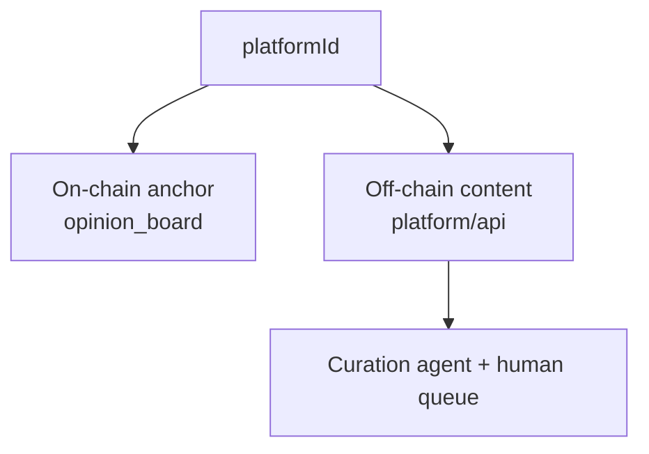

# Verified opinion platform

Layer 2 of **human** — social impact built on proof of personhood.

## Purpose

Once a person is verified as a unique human (Layer 1), they can:

* **Express opinions** in discussions without bias from identity exposure.
* **Publish articles, studies, and reports** as a verified contributor.
* Build a **persistent reputation** tied to humanity, not to legal name or address.

## Why Layer 1 must come first

Bots and Sybil accounts destroy trust in public discourse. Layer 1 guarantees **one human = one identity**. Layer 2 uses that guarantee without revealing **which** human.

## Anonymous but responsible

| Tension | Resolution |
|---|---|
| ZK hides PII | `platformId` replaces wallet address on the platform |
| Want accountability for posts | Activity is public under `platformId`, not legal identity |
| Prevent abuse | AI curation + human moderation queue |

Default: you are a **unique verified human** (no PII). What you publish is **attributed to your platform identity**, helping distinguish good-faith contribution from hate or spam.

## Architecture (hybrid)

* **On-chain:** `platformId` + `contentHash` (integrity, anti-replay).
* **Off-chain:** post body, feed, profile, articles (markdown).
* **Curation:** off-chain; reviewers see content + `platformId` only — no address, no PII.

## Curation model

1. **AI validator** — scores content against a rubric; approves, flags, or escalates.
2. **Human moderators** — handle escalated cases the agent cannot resolve.
3. **Fail-safe** — on agent error → escalate, never silently approve harmful content.

## Access model (open question)

The platform may be fully readable by anyone, or restrict reading to verified humans. Current implementation leans toward open reading with verified-only posting.

## Related

* [Layer 2 architecture](../architecture/layer-2-platform.md)
* [Platform identity (platformId)](../architecture/platform-identity.md)
* [Architecture overview](../architecture/overview.md)
