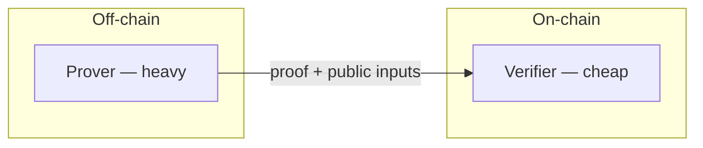

# Zero-knowledge basics

A short primer on the cryptography behind **human**.

## Zero-Knowledge Proof (ZKP)

A cryptographic proof that a statement is true **without revealing anything beyond the statement's truth**.

Example: prove *"I am over 18"* without revealing birth date or document number.

## Key terms

| Term | Meaning |
|---|---|
| **Circuit** | Program defining what is being proved (arithmetic constraints) |
| **Witness** | Public + private inputs satisfying the circuit; private part is the secret |
| **Public inputs** | Visible to the verifier (issuer root, predicate, address hash, nullifier) |
| **Proving / verifying key** | Keys from trusted setup; VK embedded in the on-chain verifier |
| **Nullifier** | Unique derived value preventing double-use without revealing identity |
| **Commitment** | Hash binding to attributes (e.g. Poseidon) provable later |
| **Merkle tree / root** | Prove membership in a set compactly |

## zk-SNARKs

*Succinct Non-interactive ARgument of Knowledge* — small proofs, fast verification.

**human** uses **Groth16** (via Circom) verified on Soroban with BLS12-381 host functions.

| System | Trusted setup | Proof size | human usage |
|---|---|---|---|
| Groth16 | Per circuit | Small | Layer 1 & 2 (current) |
| UltraHonk (Noir) | Universal | Medium | Evaluated, not primary |
| RISC Zero | Minimal | Larger | Evaluated for future |

## Where computation runs

* **Generate proof** = off-chain (user device or server).
* **Verify proof** = on-chain (Soroban + host functions).

This split is why ZK enables privacy: the chain never sees PII.

## Curves and hashes on Stellar

* **BLS12-381** — pairing-friendly curve; Groth16 verification on Soroban.
* **Poseidon** — ZK-friendly hash; native host function (Protocol 25+).
* **BN254** — also supported; alternative SNARK backends.

## Related

* [Proof of unique personhood](proof-of-unique-personhood.md)
* [Stellar and Soroban](stellar-and-soroban.md)
* [Glossary](../glossary.md)
