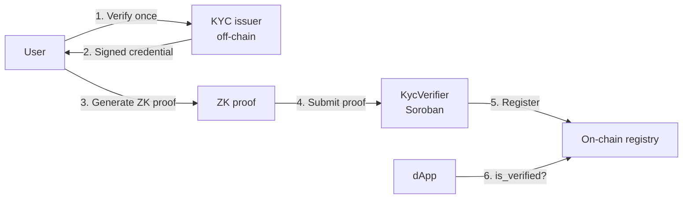

# What is human?

**human** is a **Zero-Knowledge proof-of-personhood system on Stellar**.

In one sentence: a person proves they passed real identity verification **without exposing personal data**, using a ZK proof that is **verified on-chain** in a Soroban smart contract. Other applications on Stellar can then trust that an address belongs to a unique verified human — not a bot farm — without ever seeing name, document number, or biometrics.

## The problem

Online platforms struggle with two opposing needs:

1. **Trust** — only real humans should vote, post, or access regulated services.
2. **Privacy** — people should not have to expose identity documents to every app they use.

Traditional KYC leaks personal data to each consumer. Pseudonymous blockchains leak activity history. **human** separates *verification* from *identification*.

## The solution

* **Off-chain:** identity verification and proof generation (expensive, private).
* **On-chain:** proof verification and a simple registry (`address → verified`) (cheap, public).

ZK is **load-bearing**: without it, the contract cannot trust compliance claims without receiving PII.

## What makes human different

| Property | How human achieves it |
|---|---|
| **Privacy** | PII never leaves the client except toward the issuer during enrollment |
| **Uniqueness** | Deterministic nullifier prevents Sybil registration |
| **Reusability** | Verify once; prove compliance many times |
| **Stellar-native** | Groth16 verification via Soroban host functions (BLS12-381) |

## Beyond identity: the opinion platform

Layer 1 is the technical core. Layer 2 is the social application: a **verified opinion and publishing platform** where humans debate and share knowledge **without being doxxed** — bots and fake accounts are filtered at the gate.

See [Verified opinion platform](concepts/verified-opinion-platform.md) and [Layer 2 architecture](architecture/layer-2-platform.md).

## What human is not (yet)

* Not production KYC with a licensed issuer (testnet uses a **document + face matcher**; see [Security & limitations](../security/limitations.md)).
* Not a replacement for legal compliance programs without further integration.
* Not mainnet-ready without audit and issuer hardening.

## Next steps

* [Vision and value proposition](vision-and-value.md)
* [Proof of unique personhood](../concepts/proof-of-unique-personhood.md)
* [System overview](../architecture/overview.md)
