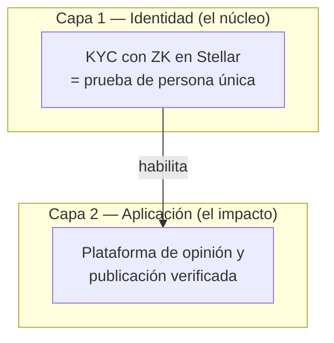

# Introducción

Bienvenido a la documentación de **human**.

**human** permite demostrar que una persona completó verificación de identidad **sin exponer datos personales on-chain**, usando pruebas Zero-Knowledge verificadas en un contrato inteligente de Stellar (Soroban). Sobre esa base, **human** impulsa una plataforma de opinión y publicación verificada donde humanos reales participan sin revelar quiénes son.

## Las dos capas

| Capa | Qué hace | Estado |
|---|---|---|
| **Capa 1** | Una persona real = una identidad verificada, de forma anónima | Implementada en testnet |
| **Capa 2** | Opinar y publicar como humano verificado pero anónimo | Primera iteración activa |
| **Funding ZK** | Crowdfunding anónimo y condicional | Trabajo futuro → [Funding ZK](proximos-pasos/funding-zk.md) |

## A quién va dirigida

* **Jurados y evaluadores** — entender el problema, por qué el ZK es esencial y qué se puede demostrar hoy.
* **Desarrolladores** — arquitectura, setup, contratos, integración del SDK.

Empezá con [Qué es human](introduccion/que-es-human.md) o saltá a [Para jurados y desarrolladores](introduccion/para-jurados-y-desarrolladores.md).

## Enlaces rápidos

* [Visión general del sistema](arquitectura/vision-general.md)
* [Flujo KYC](arquitectura/flujo-kyc.md)
* [Configuración del entorno](guias/configuracion-entorno.md)
* [Inicio rápido del SDK](sdk/inicio-rapido.md)
* [Seguridad y limitaciones](seguridad/limitaciones.md)
