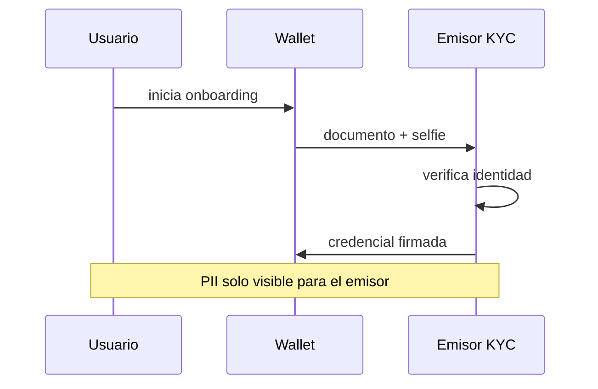
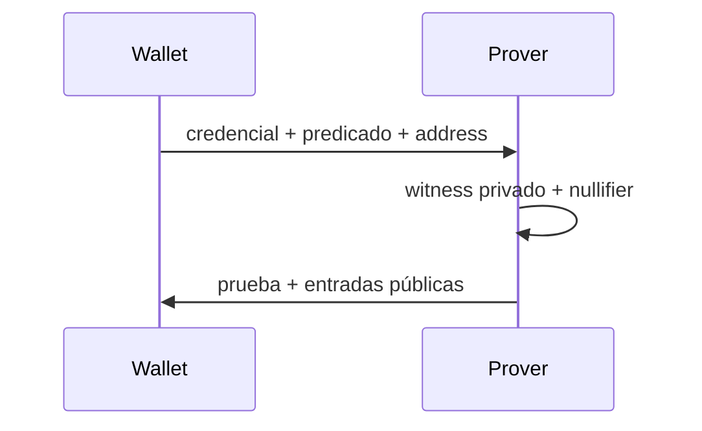
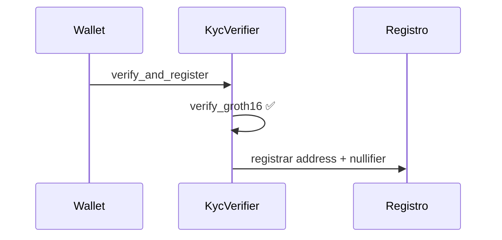
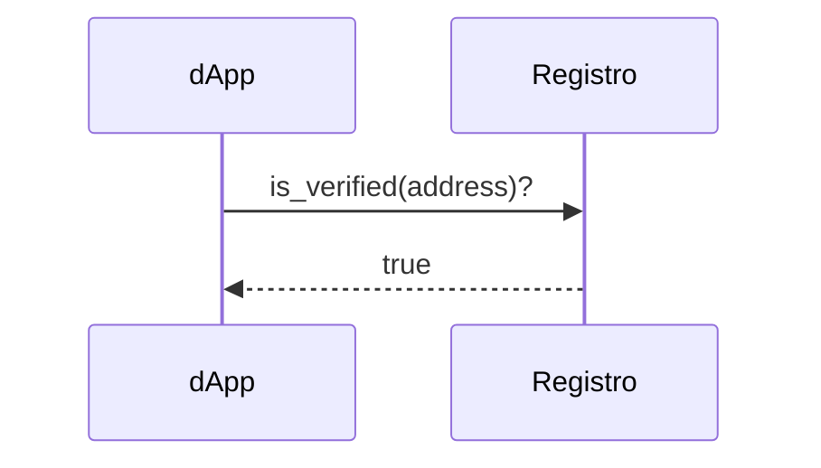

# Flujo KYC de punta a punta

Recorrido desde verificación de identidad hasta acceso en una dApp.

## Fase 1 — Emisión de credencial (una vez)

## Fase 2 — Generación de prueba

## Fase 3 — Verificación on-chain

## Fase 4 — Consumo por dApp

## Propiedades de seguridad

| Propiedad | Mecanismo |
|---|---|
| Address binding | Prueba atada a `addressHash` |
| Anti-Sybil | Nullifier on-chain |
| Emisor confiable | `issuerRoot` en contrato |
| PII contenida | Solo hacia emisor en Fase 1 |

## Referencias de código

| Fase | Código |
|---|---|
| 1 | `identity/issuer/matcher/` |
| 2 | `packages/sdk/` |
| 3 | `identity/contracts/kyc_verifier/` |
| E2E | `scripts/e2e_demo.sh` |
