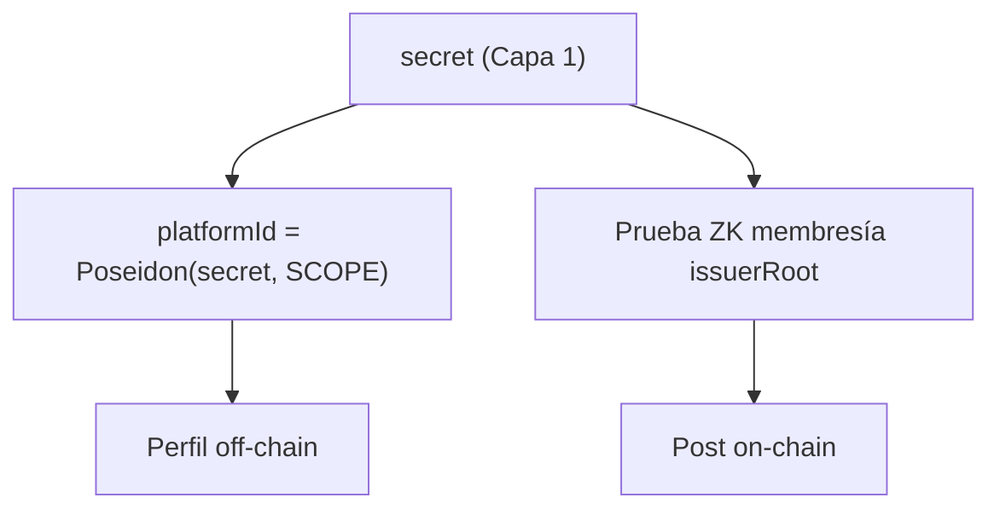

# Identidad de plataforma (platformId)

Cómo Capa 2 logra identidad **anónima pero persistente**.

## En una frase

En la plataforma no sos tu wallet del KYC — sos tu **`platformId`**, seudónimo derivado del `secret` de Capa 1 por función unidireccional.

## Construcción

## Propiedades

| Propiedad | Cómo |
|---|---|
| **Anónimo** | Poseidon unidireccional — sin PII ni address |
| **Persistente** | Mismo secret + SCOPE → mismo platformId |
| **Único** | Un secret por humano → un platformId |
| **Verificado** | Prueba ZK de membresía en cada acción |
| **Atado al contenido** | `contentHash` dentro de la prueba |

## Por qué no `is_verified(address)`?

Forzaría actuar como el address del KYC → pseudónimo, no anónimo.

## Cuentas efímeras

* **Testnet:** friendbot.
* **Producción:** relayer de fees.
