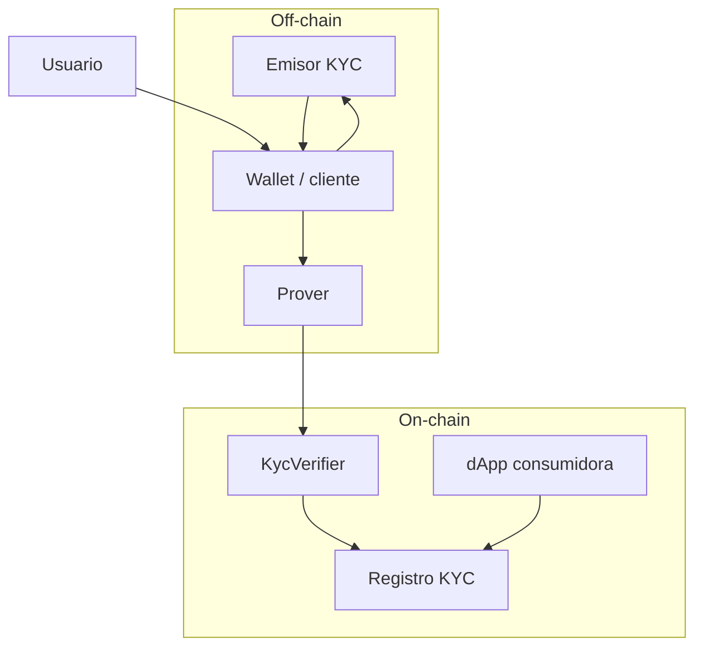
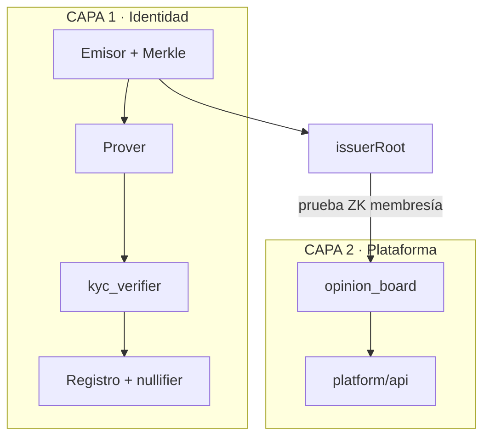

# Visión general del sistema

Vista de pájaro de los componentes de **human**.

## Componentes

## Principio de diseño

* **Probar** = off-chain (costoso, privado).
* **Verificar** = on-chain (barato con primitivas ZK de Stellar).

## Las dos capas de producto

### Dos puentes desde Capa 1

| Puente | Uso | Vinculabilidad |
|---|---|---|
| `is_verified(address)` | dApps genéricas | Pseudónimo |
| Membresía en `issuerRoot` | Plataforma anónima | Anónimo (`platformId`) |

## Mapeo a código

| Componente | Ruta |
|---|---|
| Emisor + matcher | `identity/issuer/` |
| Circuito Capa 1 | `identity/circuits/` |
| `kyc_verifier` | `identity/contracts/kyc_verifier/` |
| Plataforma | `platform/contracts/opinion_board` + `platform/api` |
| SDK | `packages/sdk/` |
| Frontend | `web/src/kyc/` + `web/src/platform/` |
