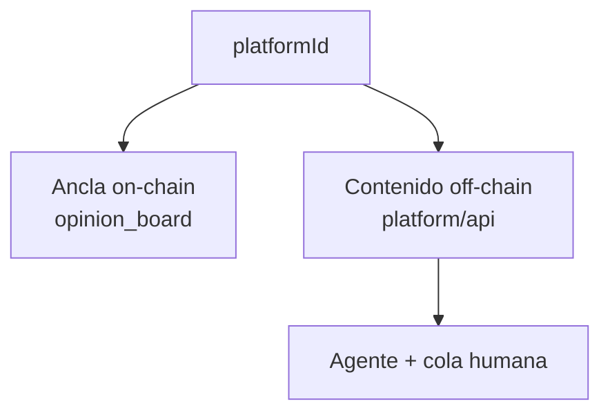

# Plataforma de opinión verificada

Capa 2 de **human** — impacto social sobre prueba de personhood.

## Propósito

Una vez verificado como humano único (Capa 1), la persona puede:

* **Opinar** en discusiones sin exposición de identidad.
* **Publicar artículos y estudios** como contribuidor verificado.
* Construir **reputación persistente** atada a humanidad, no a nombre legal.

## Anónimo pero responsable

| Tensión | Resolución |
|---|---|
| ZK oculta PII | `platformId` reemplaza el address del KYC |
| Responsabilidad sobre publicaciones | Actividad pública bajo `platformId` |
| Prevenir abuso | Curaduría IA + moderación humana |

## Arquitectura híbrida

* **On-chain:** `platformId` + `contentHash`.
* **Off-chain:** cuerpo del post, feed, perfil, artículos.
* **Curaduría:** off-chain; moderadores ven `platformId` + contenido — sin PII ni address.

## Modelo de curaduría

1. **Agente IA** — puntúa contra rúbrica; aprueba, marca o escala.
2. **Moderadores humanos** — casos escalados.
3. **Fail-safe** — error del agente → escalar, nunca aprobar silenciosamente contenido dañino.
