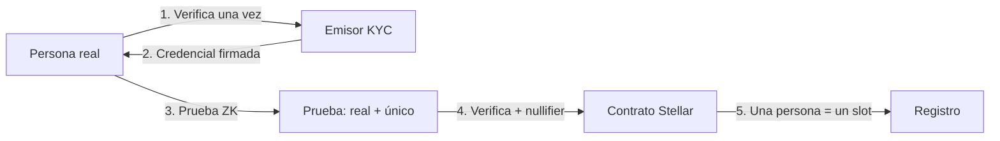

# Prueba de persona única

El núcleo técnico de **human** (Capa 1).

## Definición

Prueba criptográfica de que quien se registra es:

1. **Persona real** — pasó verificación de identidad (KYC).
2. **Única** — no puede registrarse dos veces (anti-Sybil).
3. **Anónima** — nada de lo anterior revela PII on-chain.

## La contradicción aparente

* Si es **anónima**, ¿cómo evitás 100 registros de la misma persona?
* Si garantizás **unicidad**, ¿no necesitás saber quién es?

**Respuesta:** Zero-Knowledge + **nullifier de unicidad determinístico**.

## Cómo funciona

## Nullifier de unicidad

* Mismo humano → mismo nullifier → rechazo en segundo registro.
* El nullifier **no** revela identidad (hash unidireccional).

## Qué se revela vs oculta

| Dato | ¿On-chain? |
|---|---|
| Nombre, documento, PII | Nunca |
| Que alguien está verificado | Sí (flag por address) |
| Nullifier | Sí (solo hash) |
| Qué credencial en el árbol | Oculto (ZK) |

## Implementación

* Circuito: `identity/circuits/src/kyc.circom`
* Contrato: `identity/contracts/kyc_verifier/`
* Flujo: [Flujo KYC](../arquitectura/flujo-kyc.md)
