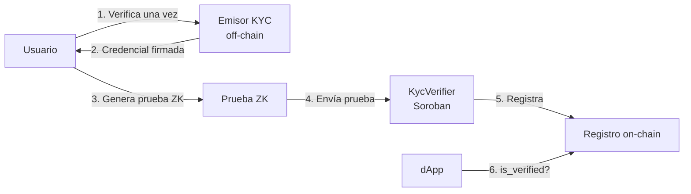

# Qué es human

**human** es un sistema de **prueba de personhood con Zero-Knowledge sobre Stellar**.

En una frase: una persona demuestra que pasó verificación de identidad real **sin exponer datos personales**, usando una prueba ZK **verificada on-chain** en un contrato Soroban. Otras aplicaciones en Stellar pueden confiar en que un address pertenece a un humano único verificado — no a una granja de bots — sin ver nombre, documento ni biometría.

## El problema

Las plataformas online enfrentan dos necesidades opuestas:

1. **Confianza** — solo humanos reales deberían votar, publicar o acceder a servicios regulados.
2. **Privacidad** — las personas no deberían exponer documentos a cada app que usan.

El KYC tradicional filtra PII a cada consumidor. Las blockchains pseudónimas filtran historial de actividad. **human** separa *verificación* de *identificación*.

## La solución

* **Off-chain:** verificación de identidad y generación de prueba (costoso, privado).
* **On-chain:** verificación de prueba y registro simple (`address → verificado`) (barato, público).

El ZK es **load-bearing**: sin él, el contrato no puede confiar en cumplimiento sin recibir PII.

## Qué diferencia a human

| Propiedad | Cómo lo logra human |
|---|---|
| **Privacidad** | La PII nunca sale del cliente salvo hacia el emisor en el enrolamiento |
| **Unicidad** | Nullifier determinístico previene registro Sybil |
| **Reutilización** | Verificás una vez; probás cumplimiento muchas veces |
| **Nativo en Stellar** | Verificación Groth16 vía host functions (BLS12-381) |

## Más allá de la identidad: la plataforma de opinión

La Capa 1 es el núcleo técnico. La Capa 2 es la aplicación social: una **plataforma de opinión y publicación verificada** donde humanos debaten y comparten conocimiento **sin ser doxxeados**.

Ver [Plataforma de opinión verificada](../conceptos/plataforma-de-opinion.md) y [Capa 2](../arquitectura/capa-2-plataforma.md).

## Qué human no es (aún)

* No es KYC de producción con emisor licenciado (testnet usa un **matcher documento + cara**).
* No reemplaza programas legales de compliance sin integración adicional.
* No está listo para mainnet sin auditoría y endurecimiento del emisor.

## Siguiente

* [Visión y propuesta de valor](vision-y-valor.md)
* [Prueba de persona única](../conceptos/prueba-de-persona-unica.md)
* [Visión general del sistema](../arquitectura/vision-general.md)
